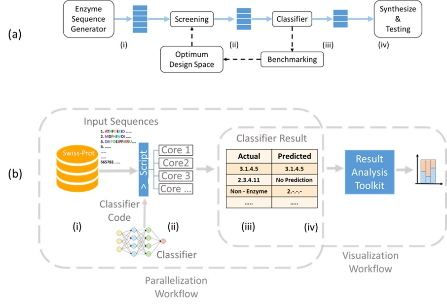

# Benchmarking-Enzyme-Classifiers

This is a repository for all the codes and data for the publication - 
Effect of Sequence Features for Benchmarking Enzyme Classification Fidelty by S. Ferdous, IF Shihab and Nigel F. Reuel
The manuscript is currently under review in Biochemical Engineering Journal. 

The workflow of the paper is given as - 

There are two folders for two prescribed workflow. 
